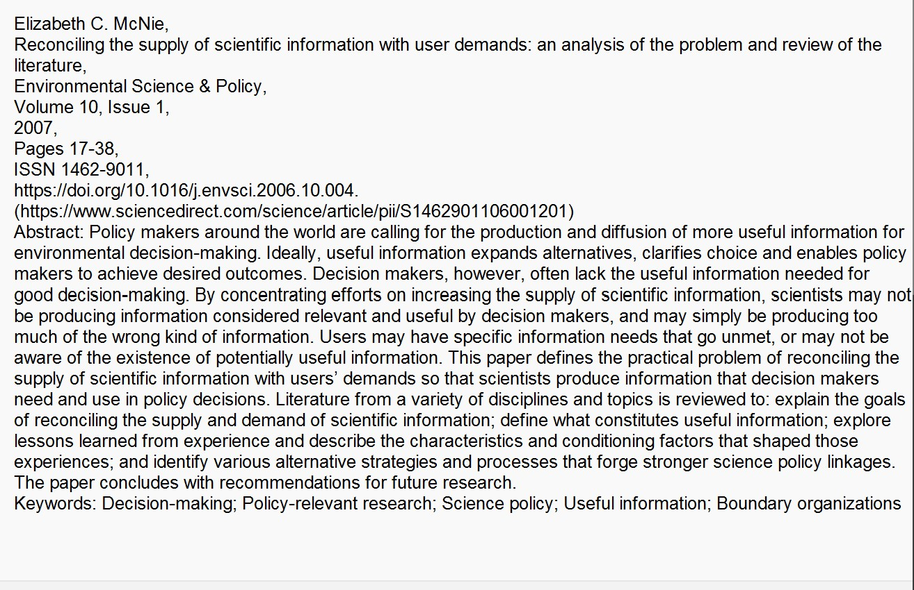
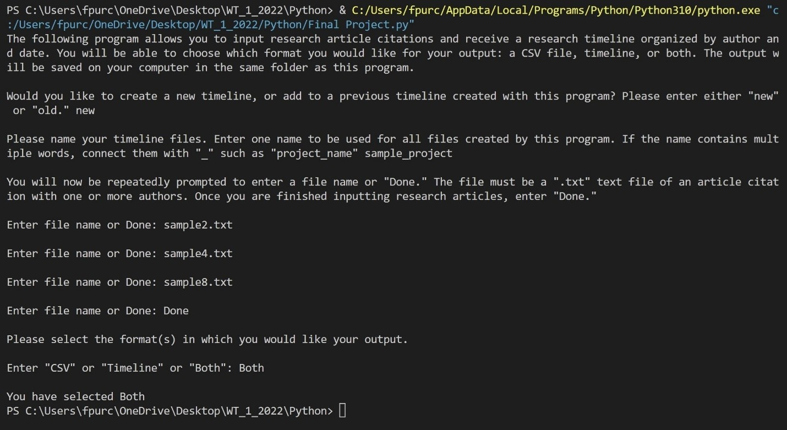
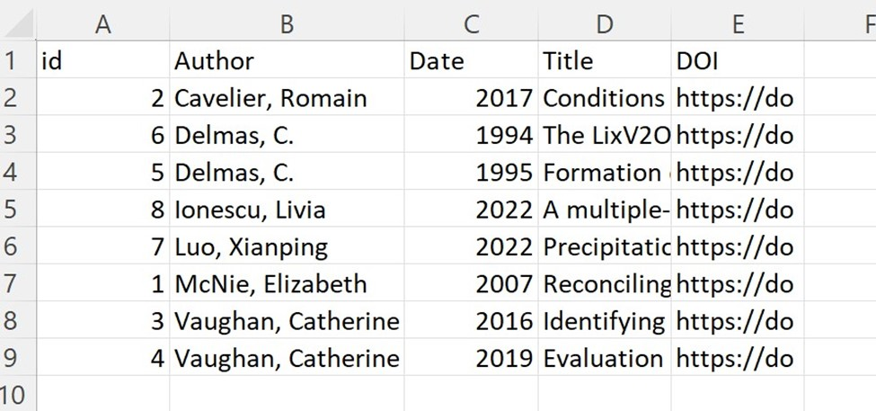
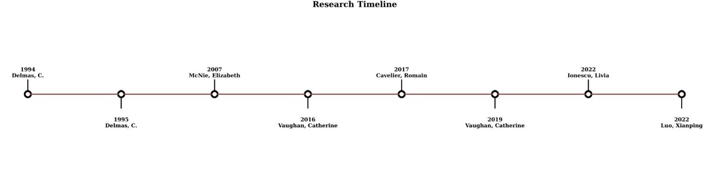

# Generating a Research Timeline

## Description
---

This program is a research management tool that generates a research timeline for the user as either a CSV or PDF timeline graphic.

#### **Motivation**

Broadly speaking, this program creates improved front-end metadata workflows for library/repository/database users. It is similar to other research management tools such as Zotero or Mendeley in that it ingests and organizes article metadata, but adds different functionalities. First, it generates more user-friendly and polished timelines that could be used both within the research process and for publication. Second, it organizes metadata by both author and date, instead of just one or the other.

#### **User and Use Cases**

The intended user is an academic researcher or student who, in the course of their work, would like to organize their information in a chronological manner. For example, they may wish to track the evolution of a concept over time or study how a particular author’s work develops in subsequent papers.

There are multiple places where this program could be integrated. One possible use case is as an extension on a database that allows users to select materials and add it to their timeline in real time as they are moving through the research process. This could be useful on both library databases with print and digital material and specialized digital subject databases. The program could also be expanded upon and developed into its own research management tool or be integrated into an existing tool.

## Program Setup
---

In order to use this tool, the following programs and libraries must be installed on the user's computer:

- Python3 (https://www.python.org/downloads/)
- SQLite DB Browser (https://sqlitebrowser.org/dl/)
- Pandas (https://pandas.pydata.org/docs/getting_started/install.html)
- Matplotlib (https://matplotlib.org/stable/users/installing/index.html)
- NumPy (https://numpy.org/install/)

## User Instructions
---

1. Download the research_timeline.py Python program and save to computer.

2. Gather research article citations in .txt format. These files can be downloaded from databases such as Elsevir in the format pictured in the below "Images" section. Be sure to save the files in the same directory and folder as the Python program.
3. Open Terminal
4. Specify the directory you would like to work in (i.e. where you saved the program and .txt files), and initiate Python and the downloaded program.
5. The tool will launch and ask the user for a series of inputs in three main steps:
    - Identifying if they would like to work on a new or old project
    - Inputting article citation text files
    - Selecting output format(s)
6. Once the user selects their output format(s), the generated file(s) will be saved on their computer in the same directory and folder as the Python program and .txt files.

## Images
---
Article citation text file format:

  
  

Front end of the program, with three sample text files as input:

  
  

Sample CSV output table with nine sample inputs:

  
  

Sample PDF timeline output with the same nine inputs:

  
  

## Credits and Resources
---
Thank you to my Python instructor, Dr. Fatemeh Kia [(University of British Columbia)](https://ischool.ubc.ca/profile/fatemeh-salehian-kia/), and the materials provided by 
Dr. Charles R. Severance on [PY4E](https://www.py4e.com/).
___
Creating a timeline using Matplotlib and NumPy: https://dadoverflow.com/2021/08/17/making-timelines-with-python/

Creating a CSV file populated with SQL data: https://www.alixaprodev.com/2022/04/sqlite-database-to-csv-file-in-python.html
